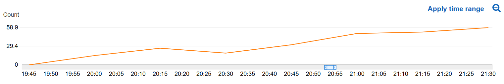

# Deep Rotor

A simulation which trains a reinforcement learning (RL) model to fly a drone.

_AWS RoboMaker sample applications include third-party software licensed under open-source licenses and is provided for demonstration purposes only. Incorporation or use of RoboMaker sample applications in connection with your production workloads or a commercial products or devices may affect your legal rights or obligations under the applicable open-source licenses. Source code information can be found [here](https://s3.console.aws.amazon.com/s3/buckets/robomaker-applications-us-east-1-72fc243f9355/deep-racer/?region=us-east-1)._

Keywords: Reinforcement learning, AWS, RoboMaker, Drone

## Requirements

- ROS Kinetic / Melodic (optional) - To run the simulation locally. Other distributions of ROS may work, however they have not been tested
- Gazebo (optional) - To run the simulation locally
- An AWS S3 bucket - To store the trained reinforcement learning model

## Get Started
1. Install [Vagrant](https://www.vagrantup.com/docs/installation/) and [Virtualbox](https://www.virtualbox.org/wiki/Downloads)

Run these commands from your host machine

2. `git clone https://github.com/kolefn/cantina-deeprotor.git`
3. `cd cantina-deeprotor`
4. `./scripts/deeprotor setup` - **10 Minutes**

This will add a `deeprotor` command to your host and guest profiles, bring up the guest VM, and install dependencies needed to build and run the simulation.

To build the simulation, run these commands

5. `deeprotor ssh` (use `deeprotor up` if the VM is not already on)
6. (In the ssh session) `deeprotor build-local`

Deeprotor also installs a desktop environment. This is required for training, evaluation, and inspecting the simulation through the Gazebo UI. The desktop is started automatically when needed but can also be run manually with `deeprotor run-gui`. Once started, you can access the GUI over VNC at `localhost:5900` on the host. [VNC Connect](https://www.realvnc.com/en/connect/download/viewer/) is the recommended VNC client.

### AWS Account Setup

#### AWS Credentials
You will need to create an AWS Account and configure the credentials to be able to communicate with AWS services. You may find [AWS Configuration and Credential Files](https://docs.aws.amazon.com/cli/latest/userguide/cli-config-files.html) helpful.

#### Creating a Session Token

1. Download and install the Amazon Command Line Interface http://docs.aws.amazon.com/cli/latest/userguide/installing.html
2. Configure the command line interface, and specify "text" as the output format http://docs.aws.amazon.com/cli/latest/userguide/cli-chap-getting-started.html
    - `aws configure`
2. Refresh the session token and temp access key/secret, stored in `.creds`
    - `deeprotor refresh-creds`

#### AWS Permissions

To train the reinforcement learning model in simulation, you need an IAM role with the following policy. You can find instructions for creating a new IAM Policy
[here](https://docs.aws.amazon.com/IAM/latest/UserGuide/access_policies_create.html#access_policies_create-start). In the JSON tab paste the following policy document:

```
{
    "Version": "2012-10-17",
    "Statement": [
        {
            "Action": [
                "cloudwatch:PutMetricData",
                "logs:CreateLogGroup",
                "logs:CreateLogStream",
                "logs:PutLogEvents",
                "logs:DescribeLogStreams",
                "s3:Get*",
                "s3:List*",
                "s3:Put*",
                "s3:DeleteObject"
            ],
            "Effect": "Allow",
            "Resource": "*"
        }
    ]
}
```

### Running the simulation

The simulation is configured using environment variables in `.env` and `.creds`, which should be created by `deeprotor setup` and `deeprotor refresh-creds`.

Once the environment variables are set and adjusted for your use, you can run local training using the deeprotor command from a GUI terminal

```bash
deeprotor train-local [--verbose]
```

#### Seeing your robot learn

As the reinforcement learning model improves, the reward function will increase. You can see the graph of this reward function using [AWS Cloudwatch](https://console.aws.amazon.com/cloudwatch/home)

Metrics in the left panel -> All -> AWSRoboMakerSimulation -> Metrics with no dimensions -> Metric Name -> DeepRotorRewardPerEpisode

You can think of this metric as an indicator into how well your model has been trained. If the graph has plateaus, then your robot has finished learning.



### Evaluating the model

#### Building the simulation bundle

You can reuse the bundle from the training phase again in the simulation phase.

#### Running the simulation

The evaluation phase requires that the same environment variables be set as in the training phase. Once the environment variables are set, you can run
evaluation using the roslaunch command from a terminal in the GUI

```bash
deeprotor evaluate [--verbose]
```

### Troubleshooting

colcon build logs are located in `simulation_ws/log`. Simulation and training logs are located in `~/.ros/log/latest`.

###### The robot does not look like it is training

The training algorithm has two phases. The first is when the reinforcement learning model is used to make the drone move in the world, 
while the second is when the algorithm uses the information gathered in the first phase to improve the model. In the second
phase, no new commands are sent to the drone, meaning it will appear as if it is stopped, spinning in circles, or drifting off
aimlessly.

## Using this sample with AWS RoboMaker

You first need to install colcon. Python 3.5 or above is required.

```bash
apt-get update
apt-get install -y python3-pip python3-apt
pip3 install colcon-ros-bundle
```

After colcon is installed you need to build your robot or simulation, then you can bundle with:

```bash
# Bundling Simulation Application
cd simulation_ws
colcon bundle
```

This produces `simulation_ws/bundle/output.tar`.
You'll need to upload this artifact to an S3 bucket. You can then use the bundle to
[create a simulation application](https://docs.aws.amazon.com/robomaker/latest/dg/create-simulation-application.html),
and [create a simulation job](https://docs.aws.amazon.com/robomaker/latest/dg/create-simulation-job.html) in AWS RoboMaker.

## License

Most of this code is licensed under the MIT-0 no-attribution license. However, the sagemaker_rl_agent package is
licensed under Apache 2. See LICENSE.txt for further information.

## How to Contribute

Create issues and pull requests against this Repository on Github
